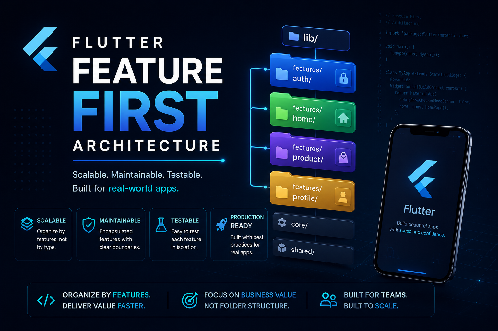

# Flutter Feature-First Starter

### A scalable Flutter foundation for modular, maintainable applications




**Author:** Ouakala Abdelaaziz

> A production-minded Flutter starter project organized around feature-first
> modules, reusable UI primitives, shared infrastructure, and clear boundaries
> between data, domain, and presentation code.

## Table of contents

- [Overview](#overview)
- [Architecture](#architecture)
- [Project structure](#project-structure)
- [Authentication example](#authentication-example)
- [Core and shared layers](#core-and-shared-layers)
- [Getting started](#getting-started)
- [Development workflow](#development-workflow)
- [Adding a feature](#adding-a-feature)
- [Quality guidelines](#quality-guidelines)
- [Roadmap](#roadmap)
- [Resources](#resources)

## Overview

This repository is a foundation rather than a finished product. It provides
conventions and working examples that make it easier to grow a Flutter
application without turning shared code into a tightly coupled monolith.

The project currently includes:

- 🧩 Feature-first module boundaries
- 🏛️ Data, domain, and presentation layers
- 🎨 Shared layouts and reusable widgets
- 🛠️ Device, responsive, color, connectivity, permission, sharing, and helper
  utilities
- ✅ Centralized validators, formatters, and extension exports
- 🔐 An authentication module demonstrating repository and data-source
  boundaries

## Architecture

The application follows a **feature-first** structure:

```text
lib/
├── core/       # Global infrastructure and stateless utilities
├── common/     # Reusable UI components shared by multiple features
└── features/   # Self-contained business modules
```

Each feature owns its implementation details. This keeps feature-specific
widgets, controllers, models, and repositories close together while `core`
contains cross-cutting infrastructure and `common` contains reusable UI.

### Layer responsibilities

| Layer | Responsibility |
| --- | --- |
| `data` | DTOs, local/remote data sources, API mapping, repository implementations |
| `domain` | Business entities and repository contracts independent of Flutter |
| `presentation` | Screens, feature controllers, and private feature widgets |
| `core` | Global services, configuration, storage, networking, utilities, and theme |
| `common` | Shared layouts and design-system widgets used across features |

## Project structure

```text
lib/
├── main.dart
├── common/
│   ├── common.dart
│   ├── layouts/
│   │   ├── app_scaffold.dart
│   │   ├── centered_constrained_body.dart
│   │   ├── layouts.dart
│   │   └── responsive_layout.dart
│   └── widgets/
│       ├── app_bar/
│       ├── buttons/
│       ├── containers/
│       ├── dialogs/
│       ├── feedback/
│       ├── icons/
│       ├── images/
│       ├── texts/
│       └── widgets.dart
├── core/
│   ├── config/           # Environment and application configuration
│   ├── constants/        # Shared application constants
│   ├── errors/           # Exceptions, failures, and error handling
│   ├── extensions/       # Reusable Dart and Flutter extensions
│   ├── middleware/       # Cross-cutting request or navigation middleware
│   ├── network/          # HTTP clients and network abstractions
│   ├── router/           # Application routes and navigation setup
│   ├── services/         # Third-party and platform service integrations
│   ├── storage/          # Local and secure persistence abstractions
│   ├── theme/            # Theme configuration and design tokens
│   └── utils/            # Stateless helpers, formatters, and validators
└── features/
    └── authentication/
        ├── data/
        │   ├── datasources/
        │   ├── models/
        │   └── repositories/
        ├── domain/
        │   ├── entities/
        │   └── repositories/
        └── presentation/
            ├── controllers/
            ├── screens/
            └── widgets/
```

## Authentication example

The authentication feature demonstrates the intended module shape:

```text
features/authentication/
├── data/
│   ├── datasources/
│   │   ├── auth_local_data_source.dart
│   │   └── auth_remote_data_source.dart
│   ├── models/
│   │   ├── auth_token_model.dart
│   │   └── user_dto.dart
│   └── repositories/
│       └── auth_repository_impl.dart
├── domain/
│   ├── entities/user_entity.dart
│   └── repositories/auth_repository.dart
└── presentation/
    ├── controllers/
    ├── screens/
    └── widgets/
```

The domain repository defines the contract, the data repository coordinates
remote and local sources, and presentation controllers expose feature state to
the screens. In a real application, replace the demo data sources with an HTTP
client and secure persistence service.

## Core and shared layers

### `core`

Global, feature-independent infrastructure lives here. The module is organized
into the following folders:

| Folder | Purpose |
| --- | --- |
| `config/` | Environment values, app configuration, and global setup |
| `constants/` | Shared keys, identifiers, and non-sensitive constants |
| `errors/` | Application exceptions, failures, and error handling |
| `extensions/` | Reusable extensions for strings, numbers, dates, collections, contexts, and widgets |
| `middleware/` | Cross-cutting processing such as request, route, or authentication middleware |
| `network/` | HTTP clients, request handling, and network-level abstractions |
| `router/` | Central route definitions, navigation configuration, and guards |
| `services/` | Platform and third-party integrations such as analytics or crash reporting |
| `storage/` | Local persistence, secure storage, cache access, and storage keys |
| `theme/` | Material themes, component themes, and design tokens |
| `utils/` | Stateless device, responsive, color, connectivity, permission, sharing, helper, formatter, and validator utilities |

Core code should remain feature-independent. If logic is meaningful only to one
feature, keep it inside that feature instead of placing it in `core`.

### `common`

Reusable presentation components belong in `common`, including buttons, cards,
dialogs, loaders, app bars, icons, images, typography, and screen layouts.
Feature-specific components should remain inside their feature instead of being
promoted prematurely to this shared layer.

## Getting started

### Prerequisites

- Flutter SDK compatible with Dart `^3.13.2`
- Android Studio or Xcode for mobile development
- A configured emulator, simulator, or physical device

### Install and run

```bash
flutter pub get
flutter analyze
flutter run
```

The repository is currently configured as a private application
(`publish_to: none`). Several commonly used packages are documented as
commented dependencies in `pubspec.yaml`; enable only the packages required by
your implementation and then run `flutter pub get`.

## Development workflow

1. Create a self-contained directory under `lib/features/<feature_name>/`.
2. Define domain contracts and entities before wiring data sources.
3. Implement data models, sources, and repository adapters.
4. Add presentation controllers, screens, and private widgets.
5. Reuse `core` utilities and `common` widgets where appropriate.
6. Run analysis and tests before opening a pull request.

## Adding a feature

For a new feature, start with this template:

```text
features/<feature_name>/
├── data/
│   ├── datasources/
│   ├── models/
│   └── repositories/
├── domain/
│   ├── entities/
│   └── repositories/
└── presentation/
    ├── controllers/
    ├── screens/
    └── widgets/
```

Keep imports flowing inward toward domain contracts. Avoid putting feature
business logic in shared widgets, global utilities, or `main.dart`.

## Quality guidelines

- Keep domain code independent from Flutter and third-party packages.
- Use repository interfaces to isolate presentation from data providers.
- Prefer immutable models and explicit conversion methods.
- Keep validation and error handling close to the relevant boundary.
- Dispose controllers, timers, streams, and other resources they own.
- Add tests for repositories, controllers, validators, and critical widgets.
- Document public helpers with examples when their behavior is non-obvious.

## Roadmap

Suggested next integrations for a production application:

- [ ] Add a real HTTP client and typed network failures
- [ ] Add secure token storage and session restoration
- [ ] Add dependency injection and application-level composition
- [ ] Add routing and guarded authenticated routes
- [ ] Add localization and generated translation resources
- [ ] Add unit, widget, and integration test coverage
- [ ] Add CI checks for formatting, analysis, and tests
- [ ] Add the architecture banner asset to `assets/images/`

## Resources

- [Flutter documentation](https://docs.flutter.dev/)
- [Dart language documentation](https://dart.dev/guides)
- [Flutter architecture recommendations](https://docs.flutter.dev/app-architecture)
- [Flutter cookbook](https://docs.flutter.dev/cookbook)

## License

This project is currently intended for private development. Add a license file
and update this section before distributing it publicly.

## Author

Created and maintained by **Ouakala Abdelaaziz**.
